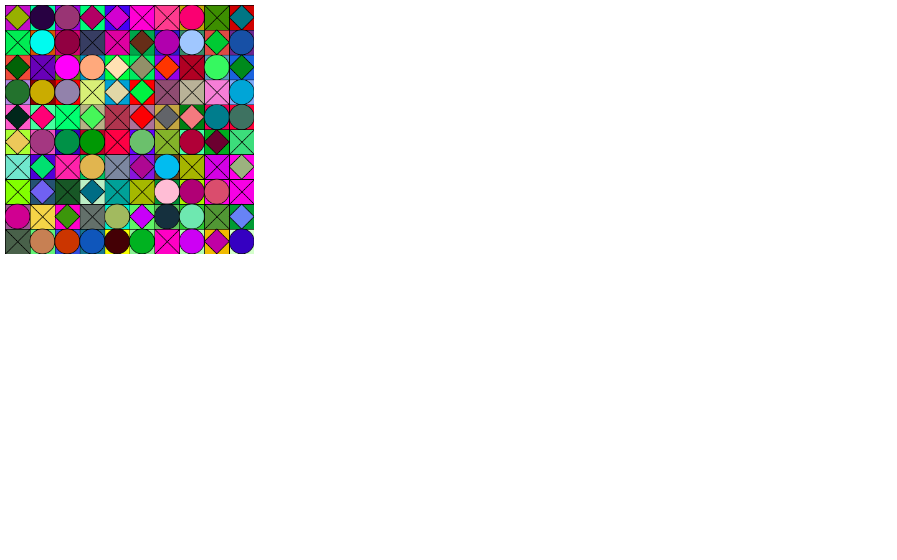

# Grid Art

This was my first project using p5.js

This project was copied from a lecture on generative art at Calvin University.

We created this:

I edited it later to make it have a color pattern:

